# Project Overview: Multilingual AI-based Real-Time Sign Language Recognition System

## 1. Technology Stack

This project is built using a modern, scalable, and highly performant full-stack architecture. It leverages the latest web technologies and machine learning frameworks to ensure real-time gesture recognition and translation.

### Frontend
* **React 18:** Used for building a highly interactive and responsive user interface.
* **Vite:** A fast build tool and development server that significantly improves the frontend development experience.
* **Tailwind CSS:** A utility-first CSS framework used for rapid UI development and maintaining a consistent, modern, and responsive design system.
* **Framer Motion:** A production-ready motion library for React utilized to create smooth, fluid, and futuristic UI animations and transitions.

### Backend
* **FastAPI (Python):** A modern, fast (high-performance) web framework for building APIs with Python 3.7+ based on standard Python type hints. Selected for its speed, automatic documentation generation (Swagger UI), and asynchronous capabilities.
* **SQLAlchemy:** The Python SQL toolkit and Object-Relational Mapper (ORM) used to interact with the database using Python objects instead of raw SQL queries.
* **SQLite:** A C-language library that implements a small, fast, self-contained, high-reliability, full-featured, SQL database engine. Used as the primary database for storing user profiles and session logs.

### Artificial Intelligence & Machine Learning
* **MediaPipe Hands:** A high-fidelity hand and finger tracking ML solution developed by Google. Used to extract 21 3D landmarks of a hand from a single frame in real-time.
* **Scikit-Learn:** Used for creating the machine learning classifier that takes the extracted hand landmarks and predicts the corresponding sign language gesture.
* **Deep-Translator:** Used to translate the recognized text from English into other target languages (e.g., Hindi, Tamil) in real-time.

### Deployment & DevOps
* **Docker:** Used to containerize the application, ensuring consistency across different environments (development, staging, production).

---

## 2. Use Case Diagram

The Use Case Diagram visualizes the interactions between the primary actors (User, Admin, AI System) and the core functionalities of the application.

```mermaid
usecaseDiagram
    actor "Registered User" as User
    actor "Administrator" as Admin
    actor "AI Recognition System" as System

    package "Sign Language Platform" {
        usecase "Register & Login" as UC1
        usecase "Manage Profile & Settings" as UC2
        usecase "Start Real-time Recognition" as UC3
        usecase "View Recognition History" as UC4
        
        usecase "Manage Users" as UC5
        usecase "View System Logs" as UC6
        
        usecase "Extract Hand Landmarks" as UC7
        usecase "Classify Gesture" as UC8
        usecase "Translate Text" as UC9
    }

    User --> UC1
    User --> UC2
    User --> UC3
    User --> UC4

    Admin --> UC1
    Admin --> UC5
    Admin --> UC6

    UC3 ..> UC7 : <<includes>>
    UC7 ..> UC8 : <<includes>>
    UC8 ..> UC9 : <<includes>>
    
    System --> UC7
    System --> UC8
    System --> UC9
```

### Explanation of Use Cases
* **Registered User:** Can log into the platform, customize their theme and preferred translation language, and start the camera to perform real-time sign language recognition. They can also view a history of their past recognition sessions.
* **Administrator:** Has elevated privileges to manage registered users and view overall system performance and session logs.
* **AI Recognition System:** A background actor that handles the heavy lifting when a user starts recognition. It processes the video feed to extract landmarks, classifies the gesture using the ML model, and translates the output text to the user's preferred language.

---

## 3. Class Diagram

The Class Diagram illustrates the static structure of the backend application, showing the core classes, layer architecture (Services, Models), and their relationships.

```mermaid
classDiagram
    class User {
        +Integer id
        +String username
        +String email
        +String full_name
        +String hashed_password
        +String role
        +String preferred_language
        +String theme
        +Boolean is_active
        +DateTime created_at
    }

    class SessionLog {
        +Integer id
        +Integer user_id
        +String gesture_detected
        +Float confidence
        +String translated_text
        +String target_language
        +Integer duration_ms
        +DateTime created_at
    }

    class AuthService {
        +authenticate_user(username, password)
        +create_access_token(data)
        +get_current_user(token)
    }

    class UserService {
        +get_user(db, user_id)
        +create_user(db, user_create)
        +update_user_theme(db, user_id, theme)
    }

    class GestureService {
        -MediaPipeHands hands_module
        -ModelLoader model_loader
        +process_frame(image_bytes)
        +extract_landmarks(image)
        +predict_gesture(landmarks)
    }

    class TranslationService {
        +translate_text(text, target_language)
    }

    class ModelLoader {
        -Classifier model
        +load_model(filepath)
        +get_model()
    }

    User "1" -- "*" SessionLog : has
    AuthService ..> User : utilizes
    UserService ..> User : manages
    GestureService ..> ModelLoader : uses
    GestureService ..> TranslationService : uses
```



### Explanation of Classes
The backend is structured using a Layered Architecture with MVC and Service Patterns:

* **Models (`User`, `SessionLog`):** These represent the SQLAlchemy database models. `User` stores authentication and preference details, while `SessionLog` tracks every successful gesture recognition event along with its confidence score and translated text.
* **AuthService & UserService:** Handle business logic related to security (JWT generation, password hashing) and user record management. They interact directly with the `User` model.
* **GestureService:** The core engine of the application. It receives video frames, uses MediaPipe to extract dimensional landmarks, and calls the `ModelLoader` to classify the gesture.
* **ModelLoader:** Implements a Singleton pattern to ensure the machine learning model (e.g., a pickle file containing a Random Forest classifier) is only loaded into memory once during application startup, saving resources and reducing latency.
* **TranslationService:** Called by the `GestureService` after a gesture is successfully recognized. It takes the English output and translates it into the user's preferred language using the `deep-translator` library.
